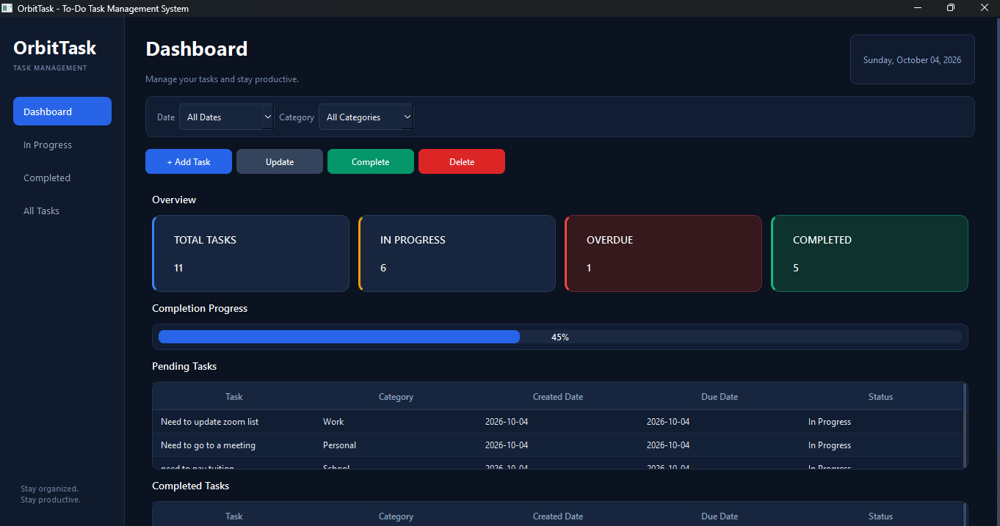
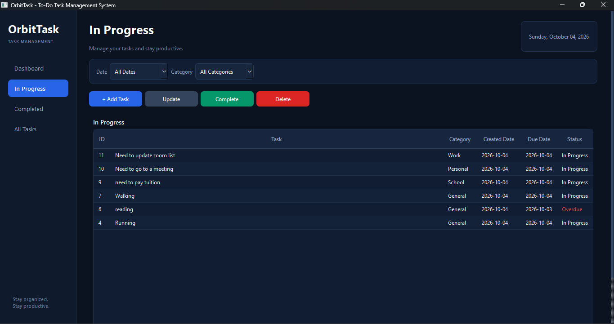
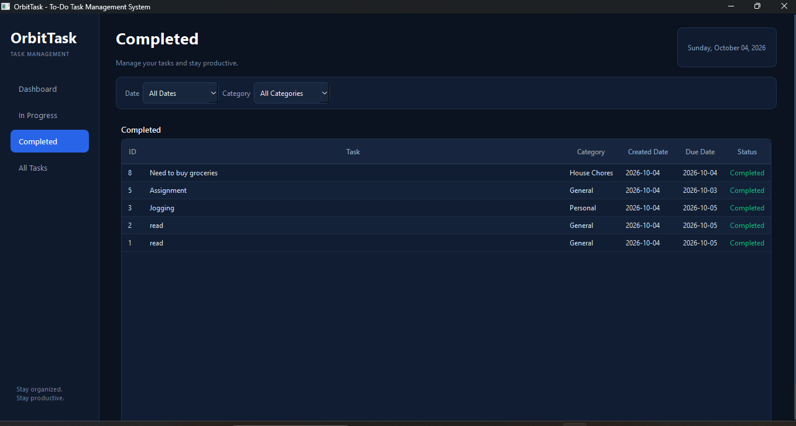
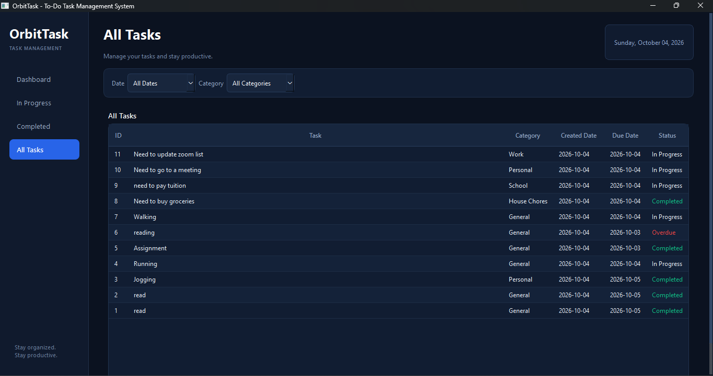

# OrbitTask - To-Do Task Management System

## Project Description

**OrbitTask** is a desktop-based To-Do Task Management System developed
using **Python and PyQt6**. The system helps users create, organize,
update, complete, and delete tasks in one application.

The system is designed to make task management simple and organized.
Users can assign categories, set created and due dates, view tasks by
status, and monitor their overall progress through the Dashboard. The
application also identifies overdue tasks so users can easily see tasks
that have passed their due date.

------------------------------------------------------------------------

## Problem Statement

Managing tasks manually can make it difficult to remember deadlines and
track which tasks are already finished. Users may also have difficulty
organizing tasks according to their categories and checking their
overall progress.

OrbitTask was created to provide a simple desktop application where
users can manage their tasks, monitor deadlines, and separate completed
and unfinished work.

------------------------------------------------------------------------

## Objectives

The main objectives of OrbitTask are:

1.  To provide a simple system for creating and managing tasks.
2.  To allow users to organize tasks using categories.
3.  To record the created date and due date of each task.
4.  To allow users to update and delete existing tasks.
5.  To mark unfinished tasks as completed.
6.  To identify overdue tasks.
7.  To provide separate views for In Progress, Completed, and All Tasks.
8.  To provide a Dashboard that summarizes task progress.
9.  To store task information using an SQLite database.
10. To demonstrate Object-Oriented Programming concepts in a practical
    application.

------------------------------------------------------------------------

## Features

### 1. Dashboard

The Dashboard provides an overview of the user's tasks. It displays:

-   Total Tasks
-   In Progress Tasks
-   Overdue Tasks
-   Completed Tasks
-   Completion Progress
-   Pending Tasks
-   Completed Tasks

### 2. Add Task

Users can create a new task by entering:

-   Task description
-   Category
-   Due date

The system automatically records the created date.

### 3. Update Task

Users can select an existing task and modify its information.

### 4. Complete Task

Users can mark an unfinished task as completed. Completed tasks are
displayed in the Completed section.

### 5. Delete Task

Users can remove a selected task from the system.

### 6. Task Categories

Tasks can be organized into the following categories:

-   General
-   School
-   House Chores
-   Work
-   Personal

### 7. Task Status

The system can display tasks according to their current status:

-   In Progress
-   Completed
-   Overdue

### 8. Task Filters

Users can filter tasks by date and category. Available date filters
include:

-   Today
-   Yesterday
-   This Week
-   This Month
-   All Dates
-   Custom Date

### 9. Task Views

The application provides separate pages for:

-   Dashboard
-   In Progress
-   Completed
-   All Tasks

### 10. SQLite Database

Task information is stored locally using SQLite, allowing the
application to save and retrieve tasks even after the program is closed.

------------------------------------------------------------------------

## Technologies Used

  Technology    Purpose
  ------------- ----------------------------
  Python        Main programming language
  PyQt6         Graphical User Interface
  SQLite        Local database
  sqlite3       Python database connection
  QSS           Application styling
  dataclasses   Task model structure
  pathlib       File and path management
  datetime      Date handling
  PyCharm       Development environment

------------------------------------------------------------------------

## Project Structure

``` text
OrbitTask/
│
├── database/
│   ├── __init__.py
│   └── database.py
│
├── features/
│   ├── __init__.py
│   └── Tasks/
│       ├── __init__.py
│       ├── model.py
│       ├── repository.py
│       ├── service.py
│       └── view.py
│
├── screenshots/
│   ├── dashboard.png
│   ├── in-progress.png
│   ├── completed.png
│   └── all-tasks.png
│
├── Style.qss
├── main.py
├── tasks.db
└── README.md
```

------------------------------------------------------------------------

## Installation and Setup

### Requirements

Before running OrbitTask, install:

-   Python 3.x
-   PyQt6

### Step 1: Clone or Download the Project

Download the project from the GitHub repository or open the project
folder in PyCharm.

### Step 2: Install PyQt6

Open the terminal in the project folder and run:

``` bash
pip install PyQt6
```

### Step 3: Run the Application

Run:

``` bash
python main.py
```

If you are using PyCharm, you can also run `main.py` directly using the
Run button.

The SQLite database is initialized automatically when the application
starts.

------------------------------------------------------------------------

## How to Use the System

### Adding a Task

1.  Open OrbitTask.
2.  Go to the Dashboard or task section.
3.  Click **Add**.
4.  Enter the task description.
5.  Select a category.
6.  Select the due date.
7.  Click **Save**.
8.  The new task will appear in the task list.

### Updating a Task

1.  Select a task from the list.
2.  Click **Update**.
3.  Modify the task information.
4.  Click **Save**.

### Completing a Task

1.  Select an unfinished task.
2.  Click **Complete**.
3.  The task will be marked as Completed.
4.  It will appear in the Completed task list.

### Deleting a Task

1.  Select the task.
2.  Click **Delete**.
3.  Confirm the deletion if prompted.

### Viewing Overdue Tasks

Tasks that pass their due date without being completed are identified as
**Overdue**. These tasks can be seen in the task lists and reflected in
the Dashboard.

### Using Filters

Use the date and category filters to display only the tasks that match
the selected criteria.

------------------------------------------------------------------------

# Object-Oriented Programming Implementation

OrbitTask applies Object-Oriented Programming principles through several
classes.

## Main Classes

### 1. Task

The `Task` class is the model of a task. It stores information such as:

-   ID
-   Title
-   Category
-   Created Date
-   Due Date
-   Completion Status

It also provides a `status` property that represents whether a task is
completed or still in progress.

### 2. TaskRepository

The `TaskRepository` class is responsible for communicating with the
SQLite database.

Its main operations include:

-   `add_task()`
-   `get_tasks_by_date()`
-   `get_all_tasks()`
-   `update_task()`
-   `complete_task()`
-   `delete_task()`

### 3. TaskService

The `TaskService` class handles the application logic between the user
interface and the repository.

It validates task information before sending operations to the
repository.

### 4. TaskDialog

The `TaskDialog` class creates the form used for adding and editing
tasks. It inherits from PyQt6's `QDialog`.

### 5. TaskView

The `TaskView` class controls the main application window and user
interface. It inherits from PyQt6's `QMainWindow`.

------------------------------------------------------------------------

## OOP Concepts Used

### Encapsulation

Encapsulation is demonstrated by separating responsibilities into
different classes.

For example:

-   `Task` manages task data.
-   `TaskRepository` manages database operations.
-   `TaskService` manages application logic.
-   `TaskView` manages the user interface.

This makes the program easier to maintain and understand.

### Inheritance

Inheritance is used with PyQt6 classes.

Examples:

``` python
class TaskDialog(QDialog):
```

and:

``` python
class TaskView(QMainWindow):
```

The custom classes inherit functionality from PyQt6's `QDialog` and
`QMainWindow`.

### Polymorphism

Polymorphism is demonstrated through the use of inherited Qt methods and
widgets. The custom classes can use and customize behavior provided by
their PyQt6 parent classes.

------------------------------------------------------------------------

# Database

OrbitTask uses **SQLite** as its local database.

## Database Table

The main table is:

### `tasks`

  Field          Type      Description
  -------------- --------- ---------------------------
  id             INTEGER   Unique task ID
  title          TEXT      Task description
  category       TEXT      Task category
  created_date   TEXT      Date the task was created
  due_date       TEXT      Task deadline
  is_completed   INTEGER   Completion status

The `is_completed` field uses:

-   `0` = Not completed
-   `1` = Completed

------------------------------------------------------------------------

## Database Operations

The system supports the basic CRUD operations:

### Create

New tasks are inserted into the database.

### Read

Tasks can be retrieved by date or all tasks can be retrieved.

### Update

Existing task information can be modified.

### Delete

Selected tasks can be removed from the database.

### Complete

A task can be marked as completed by changing its completion status.

------------------------------------------------------------------------

# Screenshots

## 1. Dashboard

The Dashboard provides an overview of the task system, including total
tasks, in-progress tasks, overdue tasks, completed tasks, completion
progress, and task lists.



## 2. In Progress

The In Progress page displays tasks that have not yet been completed.
Overdue tasks are also identified in the task list.



## 3. Completed

The Completed page displays tasks that have already been marked as
completed.



## 4. All Tasks

The All Tasks page displays all tasks stored in the system, including In
Progress, Completed, and Overdue tasks.



------------------------------------------------------------------------

# Testing

The system was tested by performing common task management operations.

  -----------------------------------------------------------------------
  Test Case         Expected Result   Actual Result     Status
  ----------------- ----------------- ----------------- -----------------
  Add a new task    New task is       Task was added    Passed
                    displayed in the  successfully      
                    task list                           

  Update a task     Selected task     Task was updated  Passed
                    information is    successfully      
                    updated                             

  Complete a task   Task changes to   Task was marked   Passed
                    Completed         as Completed      

  Delete a task     Selected task is  Task was deleted  Passed
                    removed           successfully      

  View In Progress  Unfinished tasks  Tasks were        Passed
                    are displayed     displayed         
                                      correctly         

  View Completed    Completed tasks   Tasks were        Passed
                    are displayed     displayed         
                                      correctly         

  View All Tasks    All stored tasks  Tasks were        Passed
                    are displayed     displayed         
                                      correctly         

  Check overdue     Past-due          Overdue tasks     Passed
  tasks             unfinished tasks  were identified   
                    are identified                      

  Filter tasks      Matching tasks    Filters worked as Passed
                    are displayed     expected          

  Save data         Task information  SQLite stored the Passed
                    remains stored    task data         
  -----------------------------------------------------------------------

------------------------------------------------------------------------

# Known Issues and Limitations

The current version of OrbitTask has the following limitations:

1.  The application is designed for a single local user.
2.  The database is stored locally using SQLite.
3.  There is no online synchronization.
4.  There is no user login or account system.
5.  There are no email or mobile notifications.
6.  Task categories are limited to the categories provided by the
    application.
7.  The system does not include cloud database storage.
8.  The application currently focuses on basic task management rather
    than advanced project management features.

------------------------------------------------------------------------

# Future Improvements

Possible future improvements include:

-   User login and account management
-   Cloud database support
-   Task reminders and notifications
-   Search functionality
-   More customizable categories
-   Priority levels
-   Recurring tasks
-   Task statistics and reports
-   Mobile or web version
-   Multi-user task management

------------------------------------------------------------------------

# Author

**Name:** Cyril John Dragas\
**Section:** CS26L - 3581

